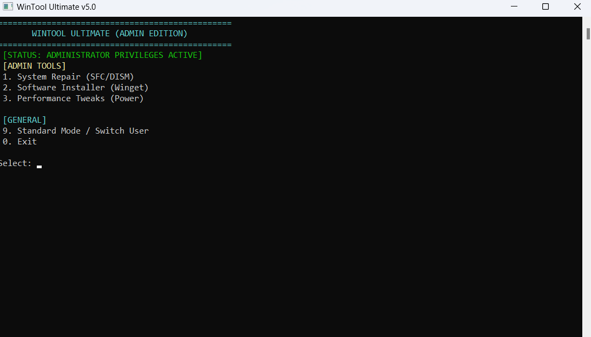
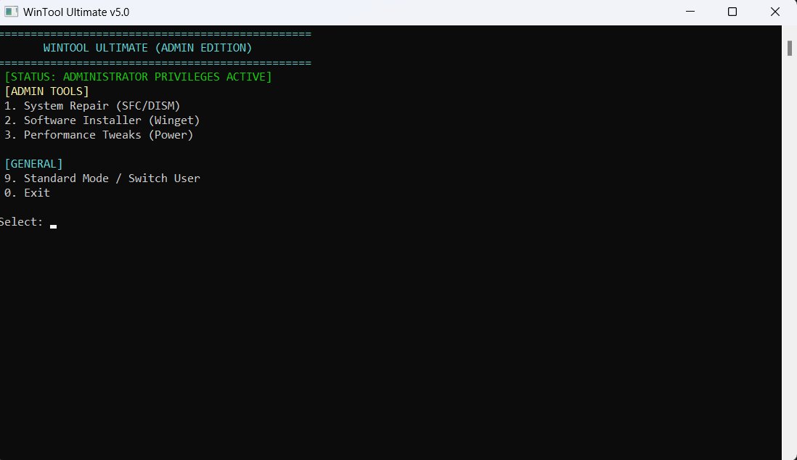
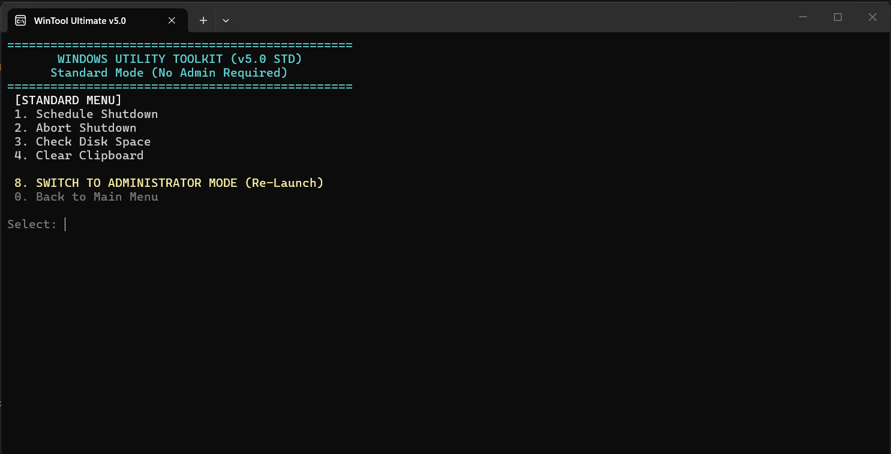

# 🛠️ WinTool Ultimate


**WinTool Ultimate** is a lightweight, all-in-one system utility toolkit designed for Windows. It combines advanced system repair tools, network management, and automation into a single console application.

The tool features **Smart Mode Switching**, automatically detecting user privileges and offering appropriate tools for both **Administrators** and **Standard Users**, with a built-in self-elevation feature.

---

## 📸 Screenshots

Here is a look at the application in action:

| **Main Menu (Admin Mode)** | **Standard User Mode** | **System Tools** |
|:---:|:---:|:---:|
|  |  |  |

---

## 🚀 Features

### 🔐 Professional Mode (Requires Admin)
* **System Repair Hub:**
    * Run `SFC /scannow` to fix corrupted system files.
    * Run `DISM` health checks and restoration.
* **Software Installer (Winget Wrapper):**
    * Instantly install popular apps (Chrome, Firefox, VS Code) without searching the web.
* **Performance Booster:**
    * Enable the hidden **"Ultimate Performance"** power plan.
* **Deep Cleaner:**
    * Clean system-wide temporary files and update caches.

### 👤 Standard Mode (No Admin Needed)
* **Smart Self-Elevation:** One-click option to "Switch to Admin Mode" (triggers UAC).
* **Scheduled Shutdown:** Set a timer to automatically shut down the PC.
* **Disk Monitor:** View real-time disk usage and free space (GB) for Drive C:.
* **Clipboard Cleaner:** Clear the copy-paste history for security.
* **Wi-Fi Password Revealer:** View saved Wi-Fi passwords instantly.

---

## ⚙️ Installation & Building

This project is built using **C++** and native **Windows APIs**. It does not require external frameworks, only a standard C++ compiler.

### Prerequisites
* Windows 10 or 11
* MinGW (G++) Compiler

### How to Compile

To bundle all necessary libraries into a single standalone `.exe` file, use the following command in your terminal:

```bash
g++ main.cpp -o WinTool.exe -static
